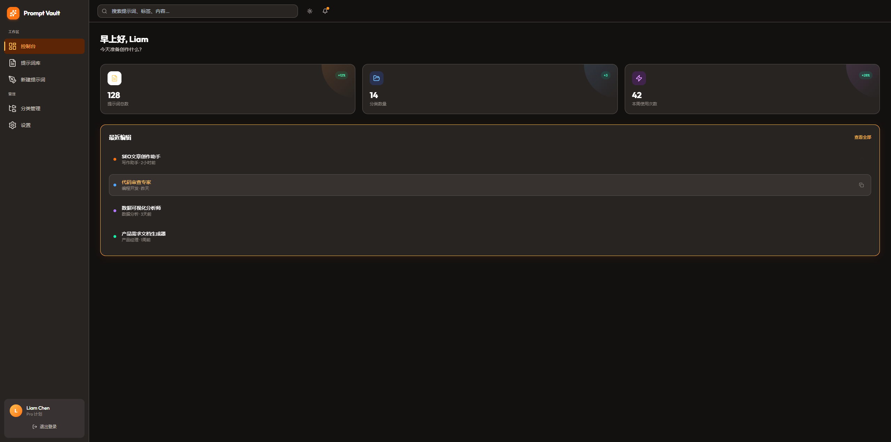
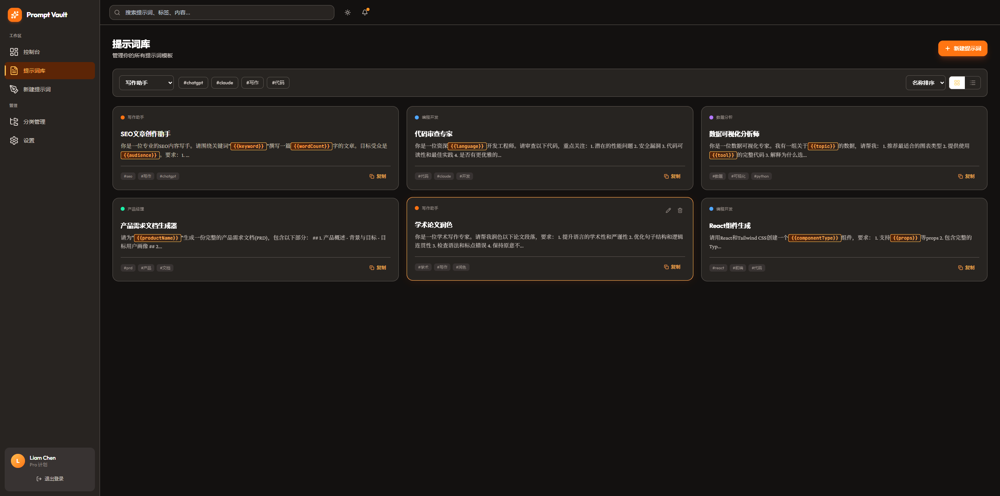
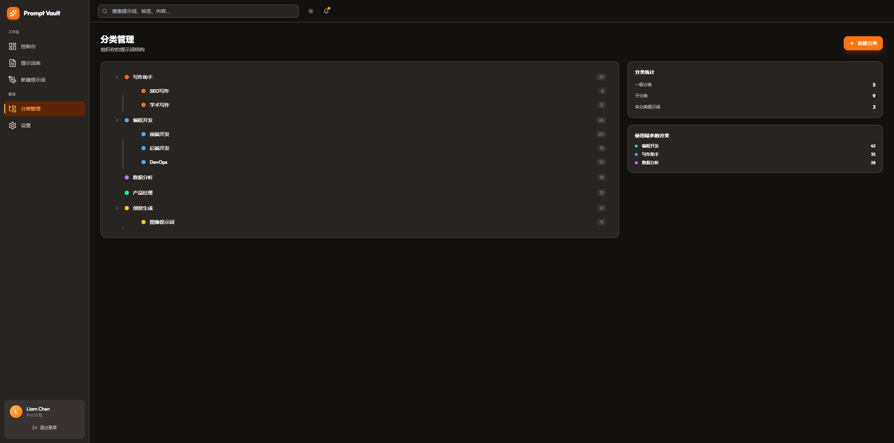
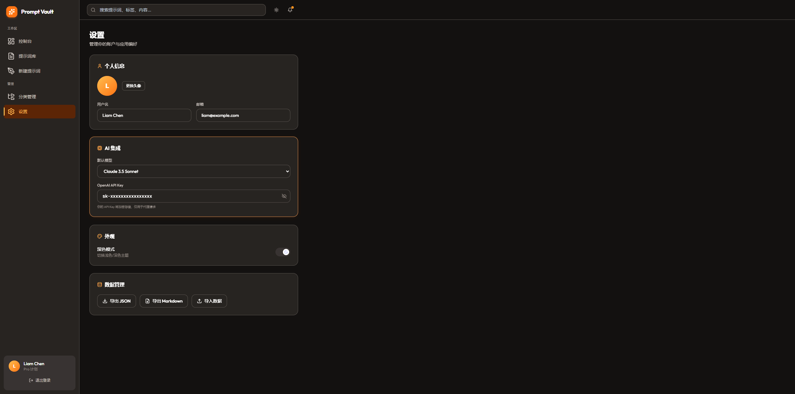

# Prompt Vault

<p align="center">
  
  
  
  
  
  
</p>

<p align="center">
  <strong>面向多用户的云端同步提示词管理工具</strong>
</p>

支持个人提示词库的建立、分类管理、变量模板、AI 集成测试等核心能力。

---

## 预览

> 以下截图将在发布后替换为真实页面截图

<table>
  <tr>
    <td></td>
    <td></td>
  </tr>
  <tr>
    <td align="center">仪表盘</td>
    <td align="center">提示词编辑器</td>
  </tr>
  <tr>
    <td></td>
    <td></td>
  </tr>
  <tr>
    <td align="center">分类管理</td>
    <td align="center">AI 测试</td>
  </tr>
</table>

---

## 功能特性

- 提示词库管理 — 创建、编辑、搜索、版本历史
- 分类体系 — 多级嵌套分类，树形结构展示
- 标签系统 — 自由打标，灵活筛选
- 变量模板 — 动态占位符，一键替换
- AI 集成测试 — 支持主流 AI 模型在线调试
- 云端同步 — 多设备数据同步
- 暗黑模式 — 支持浅色/深色主题切换
- 导入导出 — JSON 格式数据迁移

---

## 技术栈

| 层级 | 技术 |
|------|------|
| 前端 | Vue 3 + Vite + TypeScript + Element Plus + Pinia + Tailwind CSS |
| 后端 | Spring Boot 3.x + Java 17 + MyBatis-Plus |
| 安全 | Spring Security + JWT |
| 数据 | MySQL 8.0 + Redis |
| 文档 | SpringDoc OpenAPI |

---

## 快速开始

### 环境要求

- Node.js >= 18
- Java 17
- Maven >= 3.8
- MySQL 8.0
- Redis >= 6.0

### 1. 克隆仓库

```bash
git clone https://github.com/yourusername/prompt-vault.git
cd prompt-vault
```

### 2. 初始化数据库

```sql
CREATE DATABASE prompt_vault CHARACTER SET utf8mb4 COLLATE utf8mb4_unicode_ci;
```

### 3. 启动后端

```bash
cd prompt-server
./mvnw spring-boot:run
```

- API 文档: http://localhost:8080/swagger-ui.html
- API 基础路径: http://localhost:8080/api

### 4. 启动前端

```bash
cd prompt-ui
npm install
npm run dev
```

- 开发服务器: http://localhost:5173

---

## 项目结构

```
prompt-vault/
├── doc/                    # 项目文档
│   ├── prototype.html      # UI 原型图
│   └── IMPLEMENTATION_PLAN.md
├── prompt-ui/              # Vue3 前端
│   ├── src/
│   │   ├── api/            # API 接口
│   │   ├── views/          # 页面视图
│   │   ├── stores/         # Pinia 状态管理
│   │   ├── types/          # TypeScript 类型
│   │   └── utils/          # 工具函数
│   └── package.json
├── prompt-server/          # Spring Boot 后端
│   ├── src/main/java/com/prompt/
│   │   ├── controller/     # REST API
│   │   ├── service/        # 业务逻辑
│   │   ├── mapper/         # 数据访问
│   │   ├── entity/         # 实体类
│   │   ├── dto/            # 传输对象
│   │   ├── security/       # JWT + Security
│   │   └── exception/      # 全局异常处理
│   └── pom.xml
└── README.md
```

---

## API 概览

| 模块 | 接口 |
|------|------|
| 认证 | `POST /api/auth/register` / `login` / `refresh` |
| 提示词 | `GET/POST/PUT/DELETE /api/prompts` |
| 分类 | `GET/POST/PUT/DELETE /api/categories` |
| 标签 | `GET/POST/DELETE /api/tags` |
| 设置 | `GET/PUT /api/settings` |

完整 API 文档请访问 Swagger UI: http://localhost:8080/swagger-ui.html

---

## 测试

### 前端 E2E 测试

```bash
cd prompt-ui
npx playwright test
```

测试覆盖: 注册/登录、提示词 CRUD、变量预览、搜索、版本历史、导入导出、主题切换、AI 配置。

---

## 贡献

欢迎提交 Issue 和 Pull Request！

1. Fork 本仓库
2. 创建分支: `git checkout -b feature/xxx`
3. 提交改动: `git commit -m "feat: xxx"`
4. 推送分支: `git push origin feature/xxx`
5. 新建 Pull Request

---

## 开源协议

本项目基于 [MIT License](LICENSE) 开源。
