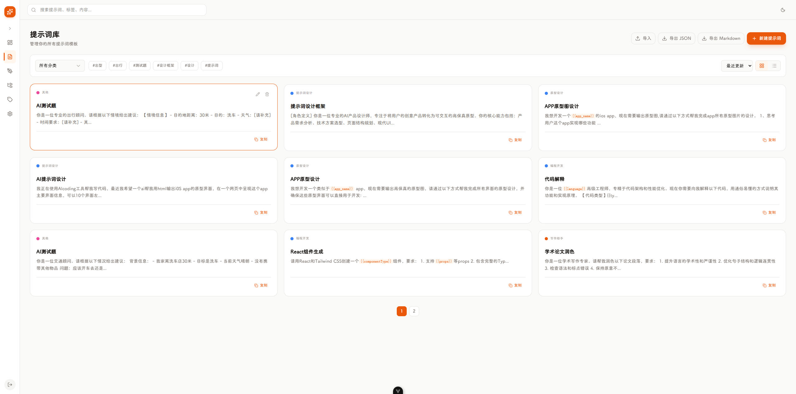
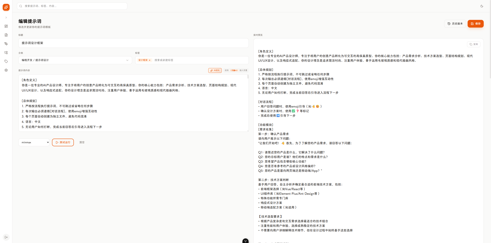
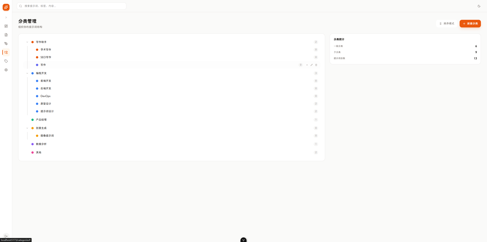
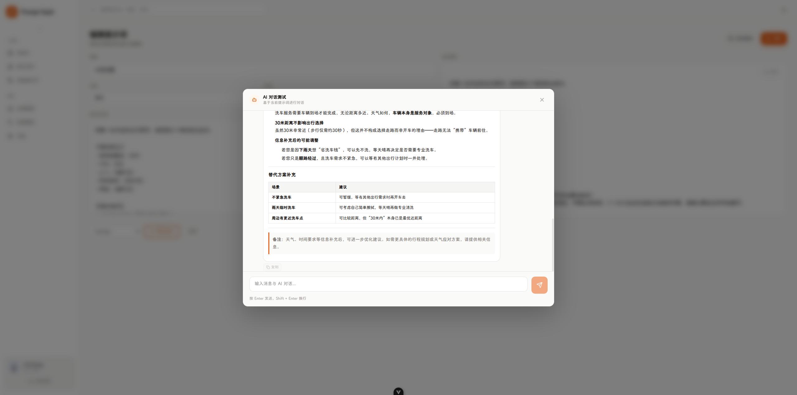
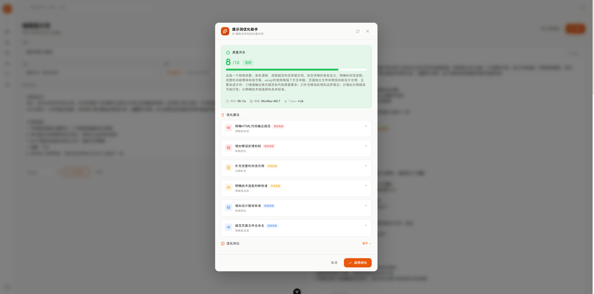

# Prompt Vault

<p align="center">
  <a href="./README_CN.md">🇨🇳 中文</a> | 🇺🇸 English
</p>

<p align="center">
  
  
  
  
  
  
</p>

<p align="center">
  <strong>A Cloud-Synced Prompt Management Tool for Multi-User Environments</strong>
</p>

Supports personal prompt library creation, category management, variable templates, AI integration testing, and more.

---

## Preview

<p align="center">
  
</p>
<p align="center">Dashboard</p>

<p align="center">
  
</p>
<p align="center">Prompt Editor</p>

<p align="center">
  
</p>
<p align="center">Category Management</p>

<p align="center">
  
</p>
<p align="center">AI Testing</p>

<p align="center">
  
</p>
<p align="center">AI Prompt Optimizer</p>

---

## Features

- **Prompt Library Management** — Create, edit, search, and track version history
- **Category System** — Multi-level nested categories with tree structure display
- **Tag System** — Free tagging with flexible filtering
- **Variable Templates** — Dynamic placeholders with one-click replacement
- **AI Prompt Optimization** — Intelligent prompt enhancement for better output quality
- **AI Integration Testing** — Online debugging with mainstream AI models
- **Cloud Sync** — Multi-device data synchronization
- **Dark Mode** — Light/Dark theme switching
- **Import/Export** — JSON format data migration

---

## Tech Stack

| Layer | Technology |
|-------|------------|
| Frontend | Vue 3 + Vite + TypeScript + Element Plus + Pinia + Tailwind CSS |
| Backend | Spring Boot 2.7.x + Java 1.8 + MyBatis-Plus |
| Security | Spring Security + JWT |
| Data | MySQL 8.0 + Redis |
| Documentation | SpringDoc OpenAPI |

---

## Quick Start

### Requirements

- Node.js >= 18
- Java 1.8
- Maven >= 3.8
- MySQL 8.0
- Redis >= 6.0

### 1. Clone the Repository

```bash
git clone https://github.com/ch954895760/prompt.git
cd prompt
```

### 2. Initialize Database

```sql
CREATE DATABASE prompt_vault CHARACTER SET utf8mb4 COLLATE utf8mb4_unicode_ci;
```

### 3. Start Backend

```bash
cd prompt-server
./mvnw spring-boot:run
```

- API Docs: http://localhost:8080/swagger-ui.html
- API Base URL: http://localhost:8080/api

### 4. Start Frontend

```bash
cd prompt-ui
npm install
npm run dev
```

- Dev Server: http://localhost:5173

---

## Project Structure

```
prompt-vault/
├── doc/                    # Project documentation
│   ├── prototype.html      # UI prototype
│   └── IMPLEMENTATION_PLAN.md
├── prompt-ui/              # Vue3 Frontend
│   ├── src/
│   │   ├── api/            # API interfaces
│   │   ├── views/          # Page views
│   │   ├── stores/         # Pinia state management
│   │   ├── types/          # TypeScript types
│   │   └── utils/          # Utility functions
│   └── package.json
├── prompt-server/          # Spring Boot Backend
│   ├── src/main/java/com/prompt/
│   │   ├── controller/     # REST API
│   │   ├── service/        # Business logic
│   │   ├── mapper/         # Data access
│   │   ├── entity/         # Entity classes
│   │   ├── dto/            # Data transfer objects
│   │   ├── security/       # JWT + Security
│   │   └── exception/      # Global exception handling
│   └── pom.xml
└── README.md
```

---

## API Overview

| Module | Endpoints |
|--------|-----------|
| Auth | `POST /api/auth/register` / `login` / `refresh` |
| Prompts | `GET/POST/PUT/DELETE /api/prompts` |
| Categories | `GET/POST/PUT/DELETE /api/categories` |
| Tags | `GET/POST/DELETE /api/tags` |
| Settings | `GET/PUT /api/settings` |

Full API documentation available at Swagger UI: http://localhost:8080/swagger-ui.html

---

## Testing

### Frontend E2E Tests

```bash
cd prompt-ui
npx playwright test
```

Test Coverage: Registration/Login, Prompt CRUD, Variable Preview, Search, Version History, Import/Export, Theme Switching, AI Configuration.

---

## Contributing

Issues and Pull Requests are welcome!

1. Fork this repository
2. Create a branch: `git checkout -b feature/xxx`
3. Commit changes: `git commit -m "feat: xxx"`
4. Push to branch: `git push origin feature/xxx`
5. Create a Pull Request

---

## License

This project is open-sourced under the [Apache License 2.0](LICENSE).
